# ProjetVisualisationFormsApp

### Objectif du Projet : 
L’outil est une application web développé en Django. 
L’idée de l’application est de pouvoir générer automatiquement et dynamiquement une page de rapport Html et que l’on puisse ajouter du texte en dessus, et enfin l’exporter en PDF pu en Word. En ayant des données issues de Microsoft Forms,

### I/ Fonctionnement générale du code :

L’outil est une application web développé en Django. Le langage de programmation est essentiellement du Python pour la partie backend, Javascript et Html pour la partie frontend. 

Le projet peut être découpé en 3 parties :
Première partie concernant l’importation des données, on doit pouvoir importer des données issues de MS Forms. Le choix est fait de ne prendre uniquement les sorties exportées par forms, donc .xlsx. 
Deuxième partie concernant la visualisation des graphiques, on doit générer une page suivant le nombre de colonne du dataset, on aura un graphique. J’ai choisi de réaliser les graphiques avec la libraire Chart.js, qui permet de faire de beaux graphiques sur une page web, en intégrant les données à la page.
On a des boutons de customisation, notamment changer le graphique, ou ajouter un texte. Il faut différentier les questions choix multiple et ouverte. On a une détection automatique du type de question, et suivant cela l’affichage est différent.
Troisième partie concernant l’exportation du rapport, où l’on veut exporter le rapport crée, au format souhaité. 


### I/ Comment faire marcher l’application :

- #### Etape Installation :

- Etape 1 : Sur le Github télécharger le projet (dézipper si besoin).
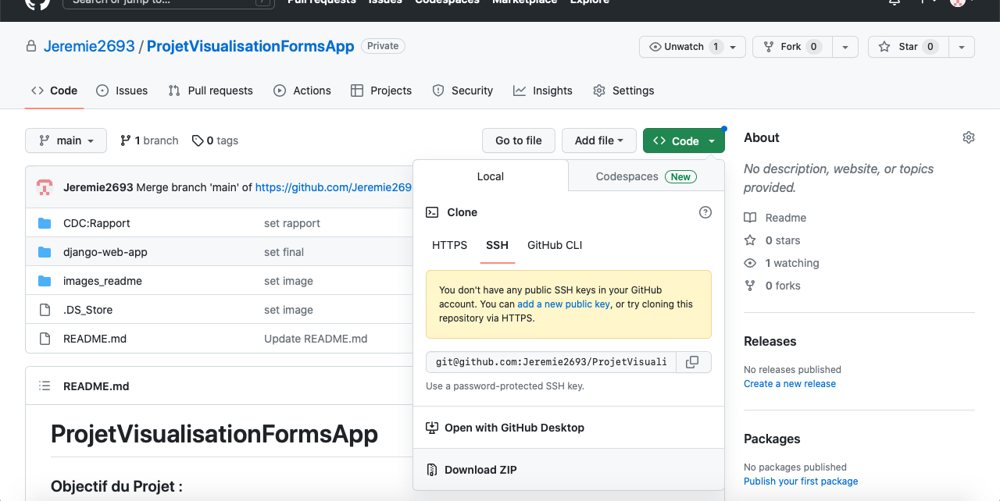

- Etape 2 (Optionnel) : déplacer le dossier téléchargé dans vos fichier application, ou vous voulez.


- #### Etape Ouverture de l’application 

<strong>En local :</strong>

- Etape 1 : Ouverture du dossier projet. 
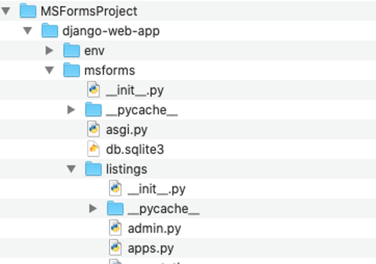

Etape 2 : ouverture du terminal du dossier ( clic droit sur django-web-app + nouveau terminal du dossier )
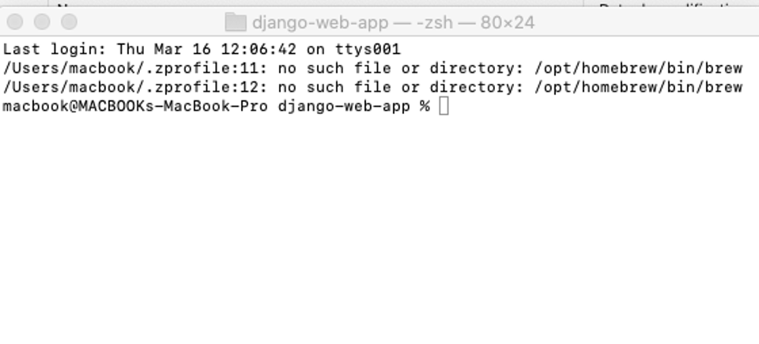

 
 note : important de se mettre dans le fichier django-web-app sinon le script en bas ne marche pas, si vous avez quelques 
 connaissances cela ne devraient pas vous poser de problèmes. 
 
- Etape 3 : (écrire  le script pour lancer le serveur web en local) 

```shell

source env/bin/activate
cd msforms
python3 manage.py runserver

```
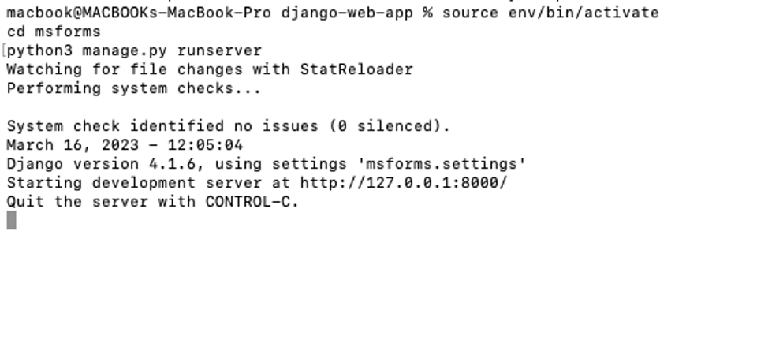

- Etape 4 : aller sur la page :  port d’écoute + /importation/ ici cliquer sur l'url: http://127.0.0.1:8000/importation/

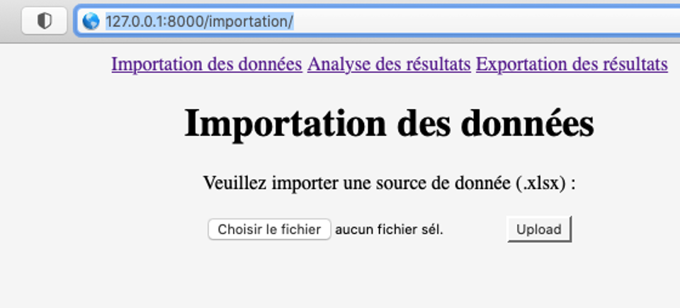

 note : si vous cliquez dessus sans avoir lancé l'application ne vous attendez pas a voir quelque chose


- #### Etape Utilisation de l’application 

- Etape 1 : utiliser l’outil : cliquer sur le bouton choisir le fichier 


Une fenêtre apparait, choisir le fichier a uploader :
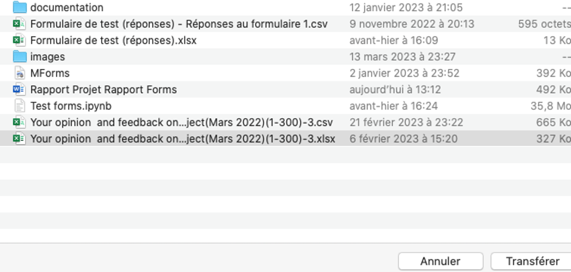
  
 Cliquer sur Transférer dans la fenêtre.
 
- Etape 2 : cliquer sur upload (redirection sur la page Analyse)

- Etape 3 : Etape analyse de résultat changement de graphique, et ajout de texte.  
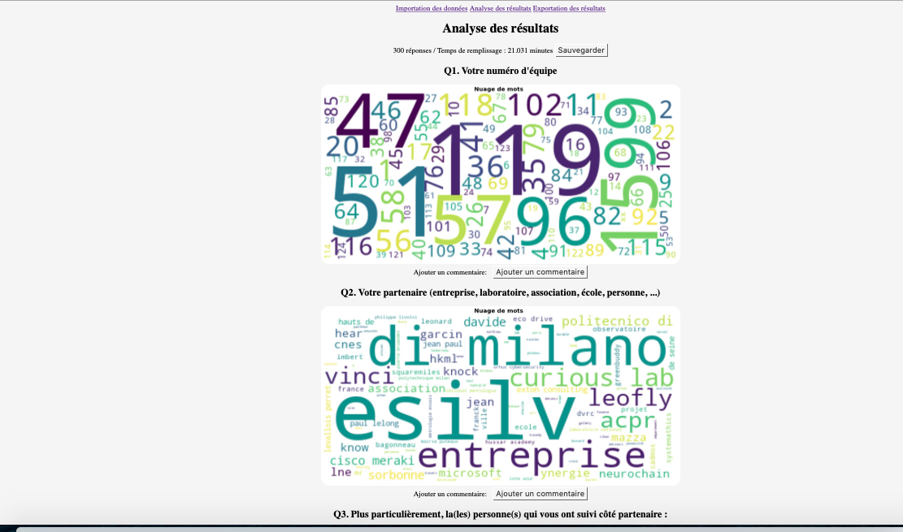
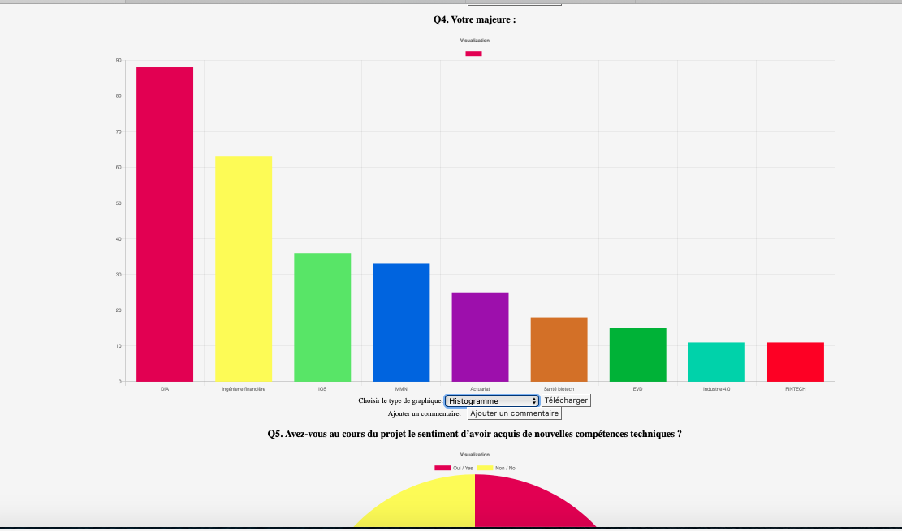
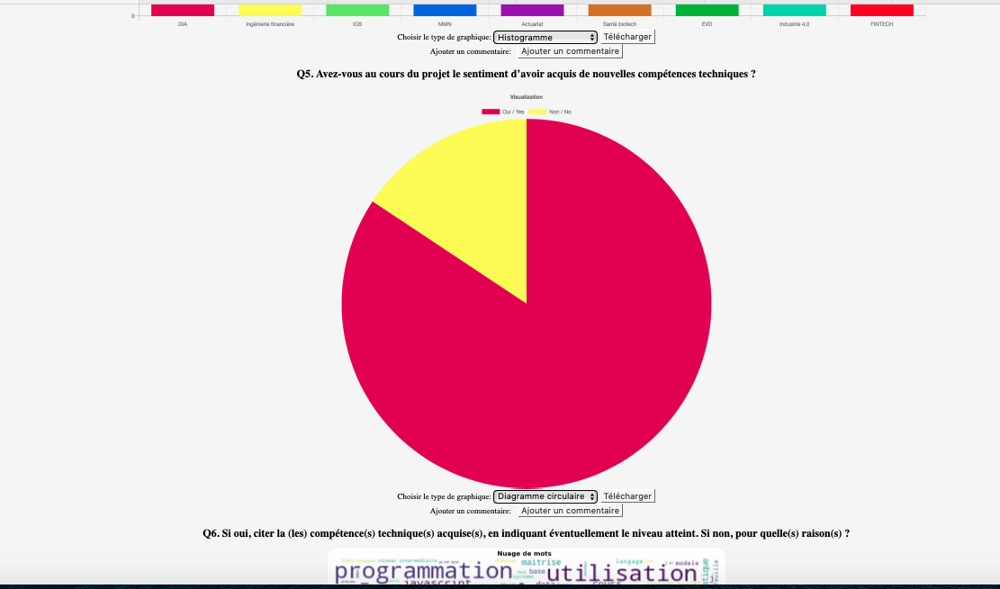


note : on peut changer le type de graphique avec le menu déroulant, le télécharger uniquement le graphique associé a une question.


- Etape 4 <strong>[Important]</strong> : cliquer sur le bouton sauvegarder de la page si vous voulez sauvegarder le texte et la séléction des images dans le rapport pdf généré. 

- Etape 5 : allez sur la page Exportation des résultats en cliquant sur Exportation des résultats : 
choisir le format puis exporter , avec aperçu ou télécharger.

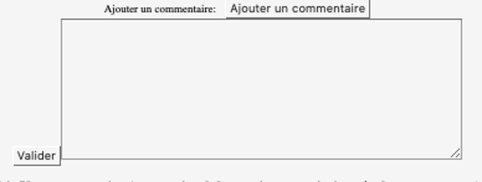
 
 
 note : il est conseillé de cliquer sur apercu avant de cliquer sur téléchargé, pour bien téléchargé le fichier.
 
 -Etape 5 : Résultat des téléchargement pdf et word.
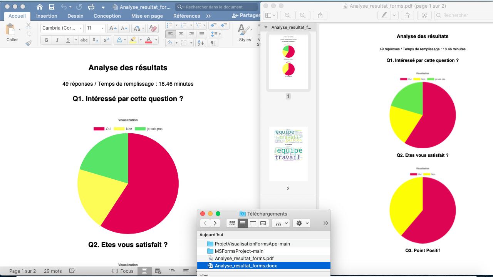


<strong>Après déploiement :</strong>

Après déploiement, il y a juste besoin d’aller sur la page web associer à l’application. Et utiliser l’application comme à l’étape 6.


### II/ Fonctionnement plus en détail du code :

Pour des explications détaillé sur le code voir le rapport technique : [rapport technique](https://github.com/Jeremie2693/ProjetVisualisationFormsApp/blob/main/CDC:Rapport/Rapport%20Projet%20Rapport%20Forms.docx)


### III/ Perspectives 

 <strong>Le plus dur a été fait tout ce qui vient après c’est de la déco.</strong>

Les 3 parties les plus dur du projet ont été réaliser, à savoir, l’importation et le pré processing, l’analyse et le rendu en html et enfin l’exportation PDF et Word. 
J’ai réussi à exporter et faire en sorte de générer un pdf dynamique et un word, ce qui a été une tache très dure, mais qui aujourd’hui marche. 

Maintenant on peut passer à la déco et s’amuser avec le code pour rendre jolie l’application en termes de graphisme. Des graphiques plus beaux, des boutons plus beaux…
Aussi le rapport généré peut être amélioré, par une typographique choisit, un filigrane ajouté. 

L'application web présentée ici présente de nombreuses perspectives d'amélioration. En effet, il est toujours possible de perfectionner une application informatique, et plusieurs améliorations pourraient être apportées.
La correction des bugs constitue également une priorité pour améliorer l'application. Un bug surprenant est la superposition des graphiques, qui peut survenir lorsqu'on change l'affichage pour un bar-plot, et qui entraîne un changement de graphique non voulu. Il serait possible de supprimer le graphique de la liste des graphiques lorsqu'on change de type d'affichage pour résoudre ce problème. La version 2 aura ces bugs corrigés, et une version 2 sera uploadé dans quelques mois. 

Par ailleurs, plusieurs nouvelles fonctionnalités pourraient être ajoutées pour améliorer l'application. Il serait notamment intéressant d'intégrer de nouveaux types de graphiques, en plus des pie-charts et des bar-charts. Des options de personnalisation pourraient également être mises en place, comme le choix de la couleur ou du nombre de mots affichés. Un bouton pour supprimer les paragraphes, les questions ou les graphiques qui ne sont pas pertinents serait également utile. Enfin, déployer l'application web pour la rendre plus facilement accessible depuis une URL serait un élément clé pour améliorer l'expérience utilisateur.

En somme, il existe de nombreuses pistes d'amélioration pour cette application web. En optimisant l'expérience utilisateur et en ajoutant de nouvelles fonctionnalités, cette application pourrait répondre encore mieux aux besoins de ses utilisateurs

### V/ Conclusion :

Ce projet s'est avéré être très intéressant car il a permis de développer de nouvelles compétences, notamment dans le domaine du développement d'application web. Toutefois, il a été extrêmement difficile à réaliser, car il comporte des fonctionnalités avancées qui ne sont pas simples à mettre en place. En effet, les fonctionnalités d'importation et d'exportation sont particulièrement complexes, car elles impliquent l'intégration d'images et de graphiques chart.js dans le résultat final, ce qui est rarement vu dans les projets de ce genre. De plus, il est nécessaire de stocker le texte saisi par l'utilisateur afin de l'exporter dans le PDF avec les commentaires.
De plus, la partie visualisation est également très difficile, car il est rare de trouver des projets dans lesquels la source de données n'est pas statique. Il est donc nécessaire de développer en généralisant par rapport à un fichier que l'on ne possède pas. Il est également nécessaire d'intégrer des graphiques, de changer les graphiques sur la page et de générer automatiquement la page, qui peut varier en fonction de la source de données. Tout cela ajoute une complexité supplémentaire à la réalisation du projet.

Enfin la partie exportation en pdf a été la partie la plus difficile. Car on doit créer un PDF dynamique et qui intègrent des images et surtout des canvas chart.js. Car on a beaucoup de contraintes associées qui limite la façon de coder. 
Puis il y a aussi l’exportation en Word. 

