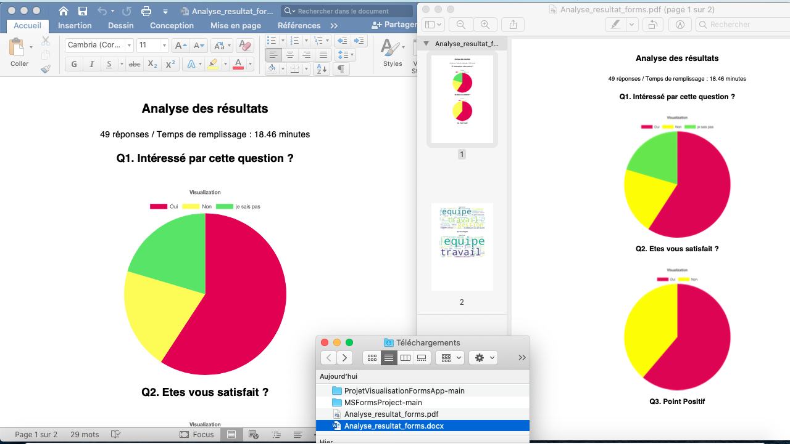

# ProjetVisualisationFormsApp

### Objectif du Projet : 
L’outil est une application web développé en Django. 
L’idée de l’application est de pouvoir générer automatiquement et dynamiquement un rapport PDF ou Word, d'un questionnaire Microsoft Forms. Ainsi l'outil génrère dynamique une page de rapport Html et que l’on peut ajouter des commentaires texte en dessous, et avant de pouvoir l’exporter en PDF ou en Word.

### I/ Fonctionnement générale du code :

L’outil est une application web développé en Django. Le langage de programmation est essentiellement du Python pour la partie backend, Javascript et Html pour la partie frontend. 

Le projet peut être découpé en 3 parties :
Première partie concernant l’importation des données, on doit pouvoir importer des données issues de MS Forms. Le choix est fait de ne prendre uniquement les sorties exportées par forms, donc .xlsx. 
Deuxième partie concernant la visualisation des graphiques, on doit générer une page suivant le nombre de colonne du dataset, on aura un graphique. J’ai choisi de réaliser les graphiques avec la libraire Chart.js, qui permet de faire de beaux graphiques sur une page web, en intégrant les données à la page.
On a des boutons de customisation, notamment changer le graphique, ou ajouter un texte. Il faut différentier les questions choix multiple et ouverte. On a une détection automatique du type de question, et suivant cela l’affichage est différent.
Troisième partie concernant l’exportation du rapport, où l’on veut exporter le rapport crée, au format souhaité. 


### I/ Comment faire marcher l’application :

- #### Etape Installation :

- Etape 1 : Sur le Github télécharger le projet (dézipper si besoin).


- Etape 2 (Optionnel) : déplacer le dossier téléchargé dans vos fichier application, ou vous voulez.


- #### Etape Ouverture de l’application 

<strong>En local :</strong>

- Etape 1 : Ouverture du dossier projet. Aller au dossier django-web-app.


Etape 2 : ouverture du terminal du dossier ( clic droit sur django-web-app + nouveau terminal du dossier )


 note : important de se mettre dans le fichier django-web-app sinon le script en bas ne marche pas, si vous avez quelques 
 connaissances cela ne devraient pas vous poser de problèmes. 
 
- Etape 3 : (écrire ou copier-coller le script pour lancer le serveur web en local) 

```shell
source env/bin/activate
cd msforms
python3 manage.py runserver

```


- Etape 4 : aller sur la page :  port d’écoute + /importation/ ici cliquer sur l'url: http://127.0.0.1:8000/importation/


 note : si vous cliquez dessus sans avoir lancé l'application ne vous attendez pas a voir quelque chose


- #### Etape Utilisation de l’application 

- Etape 1 : utiliser l’outil : cliquer sur le bouton choisir le fichier 


Une fenêtre apparait, choisir le fichier a uploader :

  
 Cliquer sur Transférer dans la fenêtre.
 
- Etape 2 : cliquer sur upload (redirection sur la page Analyse)

- Etape 3 : Etape analyse de résultat changement de graphique, et ajout de texte.  


note : on peut changer le type de graphique avec le menu déroulant, le télécharger uniquement le graphique associé a une question.


- Etape 4 <strong>[Important]</strong> : cliquer sur le bouton sauvegarder de la page si vous voulez sauvegarder le texte et la sélection des images dans le rapport pdf généré. 

- Etape 5 : allez sur la page Exportation des résultats en cliquant sur Exportation des résultats : 
choisir le format puis exporter , avec aperçu ou télécharger.


 
 
 note : il est conseillé de cliquer sur apercu avant de cliquer sur téléchargé, pour bien téléchargé le fichier. 
 L'apercu peut prendre du temps, un exemple 30secondes pour des forms long de 54 questions, a titre d'exemples, cela dépend du nombre de question. 
 
 -Etape 5 : Résultat des téléchargement pdf et word.



<strong>Après déploiement :</strong>

Après déploiement, il y a juste besoin d’aller sur la page web associer à l’application. Et utiliser l’application comme à l’étape utilisation.


#### <strong>Installation version Window :</strong>

- Etape 1 : téléchargement du projet sur Github puis déziper et placer ou vous le souhaiter.

- Etape 2 : se placer dans le dossier  django-web-app, copier le chemin (exemple : Path =C:\Users\... )

- Etape 3 : Ouvrir un terminal ou une invite de commande, taper invite de commande

- Etape 4 :Tapez la commande suivante pour accéder au répertoire de l'environnement virtuel : copier-coller : cd + le Path
exemple : 
```shell
cd C:\Users\... (bien sur ce n'est pas ce path pour vous)
```
- Etape 5 :  créer l'environement copier coller ce script
```shell
python -m venv env

```
- Etape 6 : activer l'environement copier coller ce script
```shell
env\Scripts\activate
```
- Etape 7 : Installer les requirements copier coller ce script
```shell
pip install --upgrade pip
pip install -r requirements.txt

```

- Etape 8 : aller dans le bon dossier : copier coller ce script
```shell
cd msforms
```

- Etape 9 : Lancer le serveur copier coller ce script
```shell
python manage.py runserver
```


#### <strong>Lancer l'application sur Window :</strong>
- Etape 1 : se placer dans le dossier  django-web-app, copier le chemin (exemple : Path =C:\Users\... )

- Etape 2 : Ouvrir un terminal ou une invite de commande, taper invite de commande

- Etape 3 :Tapez la commande suivante pour accéder au répertoire de l'environnement virtuel : copier-coller : cd + le Path
exemple : 
```shell
cd C:\Users\... (bien sur ce n'est pas ce path pour vous)
```
- Etape 4 : activer l'environement copier coller ce script
```shell
env\Scripts\activate
```
- Etape 5 : aller dans le bon dossier : copier coller ce script
```shell
cd msforms
```

- Etape 6 : Lancer le serveur copier coller ce script
```shell
python manage.py runserver
```
- Etape 7 : aller sur la page :  port d’écoute + /importation/ ici cliquer sur l'url: http://127.0.0.1:8000/importation/


### II/ Fonctionnement plus en détail du code :

Pour des explications détaillé sur le code voir le rapport technique : [rapport technique](https://github.com/Jeremie2693/ProjetVisualisationFormsApp/blob/main/CDC:Rapport/CDC_Projet_rapport_forms_Berrebi_jérémie.pdf))


### III/ Perspectives 

 <strong>Le plus dur a été fait tout ce qui vient après c’est de la décoration.</strong>
 
Les trois parties les plus difficiles du projet ont été réalisées, à savoir l'importation et le prétraitement des données, l'analyse et la génération de rendus en HTML, ainsi que l'exportation en PDF et Word. J'ai réussi à exporter et à générer un PDF dynamique et un document Word, ce qui a été une tâche très difficile, mais qui fonctionne désormais correctement.

Maintenant, nous pouvons passer à la décoration et nous amuser avec le code pour rendre l'application graphiquement plus attrayante, avec de meilleurs graphiques, des boutons plus esthétiques, etc. De plus, le rapport généré pourrait être amélioré en choisissant une typographie adaptée et en ajoutant un filigrane.

L'application web présentée ici offre de nombreuses perspectives d'amélioration. En effet, il est toujours possible de perfectionner une application informatique, et plusieurs améliorations pourraient être apportées.
La correction des bugs constitue également une priorité pour améliorer l'application. Un bug surprenant est la superposition des graphiques, qui peut survenir lorsqu'on change l'affichage pour un graphique à barres et qui entraîne un changement de graphique non voulu. Pour résoudre ce problème, il serait possible de supprimer le graphique de la liste des graphiques lorsqu'on change de type d'affichage. La version 2 corrigera ces bugs, et sera mise en ligne dans quelques mois.

Par ailleurs, plusieurs nouvelles fonctionnalités pourraient être ajoutées pour améliorer l'application. Il serait notamment intéressant d'intégrer de nouveaux types de graphiques, en plus des diagrammes circulaires et des graphiques à barres. Des options de personnalisation pourraient également être mises en place, comme le choix de la couleur ou du nombre de mots affichés. Un bouton pour supprimer les paragraphes, les questions ou les graphiques qui ne sont pas pertinents serait également utile. Enfin, déployer l'application web pour la rendre plus facilement accessible depuis une URL serait un élément clé pour améliorer l'expérience utilisateur.

En somme, il existe de nombreuses pistes d'amélioration pour cette application web. En optimisant l'expérience utilisateur et en ajoutant de nouvelles fonctionnalités, cette application pourrait mieux répondre aux besoins de ses utilisateurs.


### V/ Conclusion :

Ce projet s'est avéré être très intéressant car il a permis de développer de nouvelles compétences, notamment dans le domaine du développement d'applications web. Toutefois, il a été extrêmement difficile à réaliser, car il comporte des fonctionnalités avancées qui ne sont pas simples à mettre en place. En effet, les fonctionnalités d'importation et d'exportation sont particulièrement complexes, car elles impliquent l'intégration d'images et de graphiques chart.js dans le résultat final, ce qui est rarement vu dans les projets de ce genre. De plus, il est nécessaire de stocker le texte saisi par l'utilisateur afin de l'exporter dans le PDF avec les commentaires.

De plus, la partie visualisation est également très difficile, car il est rare de trouver des projets dans lesquels la source de données n'est pas statique. Il est donc nécessaire de développer en généralisant par rapport à un fichier que l'on ne possède pas. Il est également nécessaire d'intégrer des graphiques, de changer les graphiques sur la page et de générer automatiquement la page, qui peut varier en fonction de la source de données. Tout cela ajoute une complexité supplémentaire à la réalisation du projet.


Enfin la partie exportation en pdf a été la partie la plus difficile. Car on doit créer un PDF dynamique et qui intègre des images et surtout des Canvas chart.js. Car on a beaucoup de contraintes associées qui limitent la façon de coder. Puis il y a aussi l’exportation en Word qui a été réalisé. 


