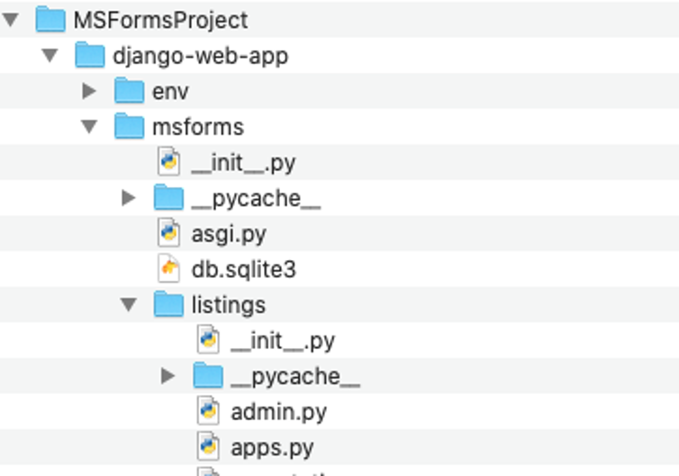
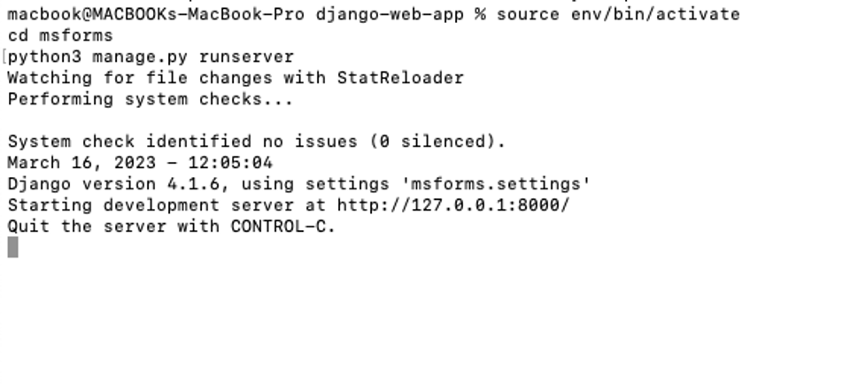
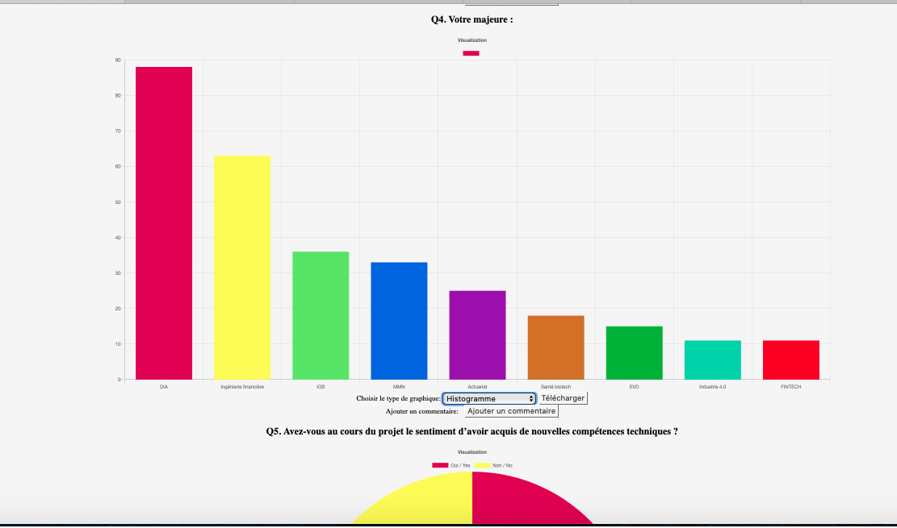
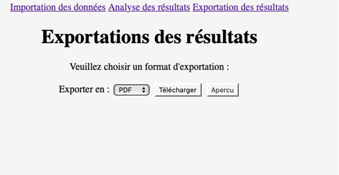

# ProjetVisualisationFormsApp

### I/ Etape Installation  :


- Etape 1 : Sur le Github télécharger le projet (dézipper si besoin).


- Etape 2 (Optionnel) : déplacer le dossier téléchargé dans vos fichier application, ou vous voulez.


- #### Etape Ouverture de l’application 

<strong>En local :</strong>

- Etape 1 : Ouverture du dossier projet. Aller au dossier django-web-app.


Etape 2 : ouverture du terminal du dossier ( clic droit sur django-web-app + nouveau terminal du dossier )


 note : important de se mettre dans le fichier django-web-app sinon le script en bas ne marche pas, si vous avez quelques 
 connaissances cela ne devraient pas vous poser de problèmes. 
 
- Etape 3 : (écrire ou copier-coller le script pour lancer le serveur web en local) 

```shell
source env/bin/activate
cd msforms
python3 manage.py runserver

```


- Etape 4 : aller sur la page :  port d’écoute + /importation/ ici cliquer sur l'url: http://127.0.0.1:8000/importation/


 note : si vous cliquez dessus sans avoir lancé l'application ne vous attendez pas a voir quelque chose


- #### Etape Utilisation de l’application 

- Etape 1 : utiliser l’outil : cliquer sur le bouton choisir le fichier 


Une fenêtre apparait, choisir le fichier a uploader :

  
 Cliquer sur Transférer dans la fenêtre.
 
- Etape 2 : cliquer sur upload (redirection sur la page Analyse)

- Etape 3 : Etape analyse de résultat changement de graphique, et ajout de texte.  




note : on peut changer le type de graphique avec le menu déroulant, le télécharger uniquement le graphique associé a une question.


- Etape 4 <strong>[Important]</strong> : cliquer sur le bouton sauvegarder de la page si vous voulez sauvegarder le texte et la sélection des images dans le rapport pdf généré. 

- Etape 5 : allez sur la page Exportation des résultats en cliquant sur Exportation des résultats : 
choisir le format puis exporter , avec aperçu ou télécharger.


 
 
 note : il est conseillé de cliquer sur apercu avant de cliquer sur téléchargé, pour bien téléchargé le fichier. 
 L'apercu peut prendre du temps, un exemple 30secondes pour des forms long de 54 questions, a titre d'exemples, cela dépend du nombre de question. 
 
 -Etape 5 : Résultat des téléchargement pdf et word.


<strong>Après déploiement :</strong>

Après déploiement, il y a juste besoin d’aller sur la page web associer à l’application. Et utiliser l’application comme à l’étape utilisation.
